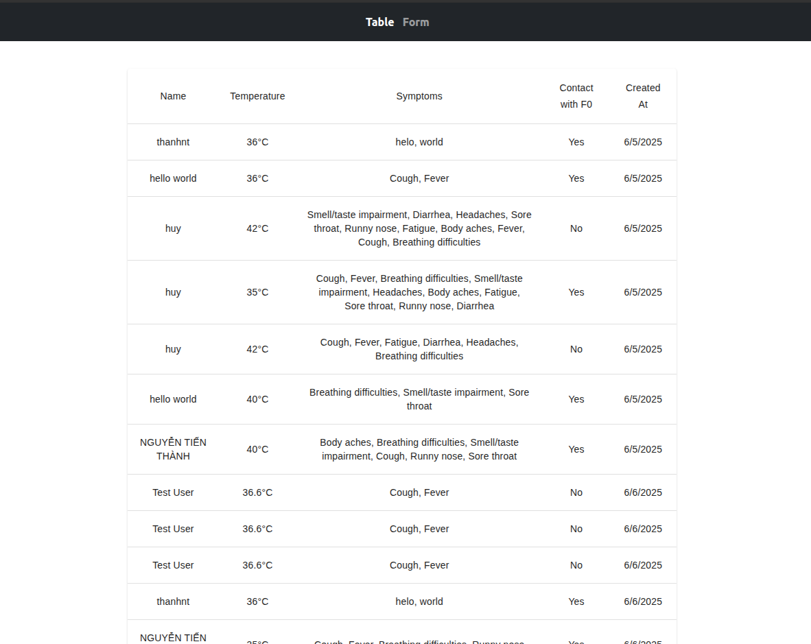
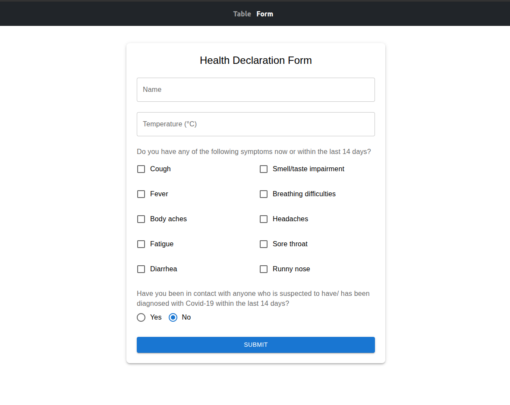

# Health Declaration Frontend

A simple health declaration system built with React + TypeScript + Vite.


## Tech Stack

- React 18 + TypeScript
- Vite (build tool)
- Material-UI + Tailwind CSS
- React Hook Form
- Axios + Jest

## Quick Start

### 1. Install dependencies
```bash
cd client
npm install
```

### 2. Start development server
```bash
npm run dev
```
App runs at: http://localhost:5173

### 3. Run tests
```bash
npm test
```

### 4. Build for production
```bash
npm run build
```

## Features

- Health declaration form with validation
- Data table showing all submissions
- Comprehensive test coverage

## Project Structure

```
src/
├── components/     # UI components
├── pages/         # Main pages
├── services/      # API calls
├── utils/         # Helper functions
├── api/           # Axios config
```

## API Endpoints

- GET `/api/health-declaration` - Get all declarations
- POST `/api/health-declaration` - Create new declaration

Backend server runs on port 3000.

---

## Demo


*Health Declaration Information Table*



*Health Declaration Input Form*

Need help? Check `package.json` or contact the dev team.
